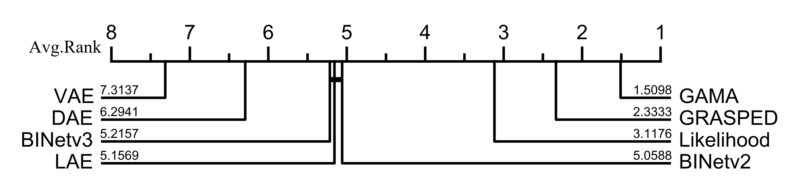

# Survey and Benchmark of Anomaly Detection in Business Processes

**Abstract**: Business processes are prone to anomalies that can arise from various factors, such as software
malfunctions and operator errors. These anomalies can significantly impact the financial health of a business and impede
our ability to extract valuable insights from event logs. As a result, anomaly detection has become an essential area of
research in process mining to identify and resolve these issues. Numerous methods for detecting anomalies in business
processes have been proposed recently. However, the relative merits of each method remain unclear due to differences in
their experimental setup, choice of datasets and evaluation measures. In this paper, we present a systematic literature
review and taxonomy of business process anomaly detection methods. Additionally, we select at least one method from each
category, resulting in 14 methods that are cross-benchmarked against 32 synthetic logs and 19 real-life logs from
different industry domains. Our analysis provides insights into the strengths and weaknesses of different anomaly
detection methods. Ultimately, our findings can help researchers and practitioners in the field of process mining make
informed decisions when selecting and applying anomaly detection methods to real-life business scenarios. Finally, some
future directions are discussed in order to promote the evolution of business process anomaly detection.

### Studied Models

|   Model    | Year |    Perspective    |   Granularity   |                                                                                                                                Paper                                                                                                                                |
|:----------:|:----:|:-----------------:|:---------------:|:-------------------------------------------------------------------------------------------------------------------------------------------------------------------------------------------------------------------------------------------------------------------:|
|   Naive    | 2013 |   Control-flow    |   Trace-level   |                                                 [Algorithms for anomaly detection of traces in logs of process aware information systems](https://www.sciencedirect.com/science/article/abs/pii/S0306437912000567)                                                  |
|  Sampling  | 2013 |   Control-flow    |   Trace-level   |                                                 [Algorithms for anomaly detection of traces in logs of process aware information systems](https://www.sciencedirect.com/science/article/abs/pii/S0306437912000567)                                                  |
| Likelihood | 2016 | Multi-perspective | Attribute-level |                                                              [Multi-perspective anomaly detection in business process execution events](https://link.springer.com/chapter/10.1007/978-3-319-48472-3_5)                                                              |
|    DAE     | 2018 | Multi-perspective | Attribute-level |                                                                       [Analyzing business process anomalies using autoencoders](https://link.springer.com/article/10.1007/s10994-018-5702-8)                                                                        |
|  BINetv2   | 2018 | Multi-perspective | Attribute-level |                                                            [BINet: Multivariate business process anomaly detection using deep learning](https://link.springer.com/chapter/10.1007/978-3-319-98648-7_16)                                                             |
|    VAE     | 2019 | Multi-perspective | Attribute-level |                                                                 [Autoencoders for improving quality of process event logs](https://www.sciencedirect.com/science/article/abs/pii/S0957417419302829)                                                                 |
|    LAE     | 2019 | Multi-perspective | Attribute-level |                                                                 [Autoencoders for improving quality of process event logs](https://www.sciencedirect.com/science/article/abs/pii/S0957417419302829)                                                                 |
|  W2V-LOF   | 2020 |   Control-flow    |   Trace-level   |                                                                              [Anomaly Detection on Event Logs with a Scarcity of Labels](https://ieeexplore.ieee.org/document/9230308)                                                                              |
| VAE-OCSVM  | 2021 |   Control-flow    |   Trace-level   |                                                                      [Variational Autoencoder for Anomaly Detection in Event Data in Online Process Mining](https://arxiv.org/abs/2208.03326)                                                                       |
|    GAE     | 2021 | Multi-perspective |   Trace-level   |                                                                     [Graph Autoencoders for Business Process Anomaly Detection](https://link.springer.com/chapter/10.1007/978-3-030-85469-0_26)                                                                     |
|  Leverage  | 2022 |   Control-flow    |   Trace-level   |                                      [Keeping our rivers clean: Information-theoretic online anomaly detection for streaming business process events](https://www.sciencedirect.com/science/article/abs/pii/S0306437921001125)                                      |
|  BINetv3   | 2022 | Multi-perspective | Attribute-level |                                                             [BINet: Multi-perspective business process anomaly classification](https://www.sciencedirect.com/science/article/abs/pii/S0306437919305101)                                                             |
|  GRASPED   | 2023 | Multi-perspective | Attribute-level |                                                             [GRASPED: A GRU-AE Network Based Multi-Perspective Business Process Anomaly Detection Model](https://ieeexplore.ieee.org/document/10088425)                                                             |
|    GAMA    | 2023 | Multi-perspective | Attribute-level | [GAMA: A Multi-graph-based Anomaly Detection Framework for Business Processes via Graph Neural Networks](https://www.techrxiv.org/articles/preprint/GAMA_A_Multi-graph-based_Anomaly_Detection_Framework_for_Business_Processes_via_Graph_Neural_Networks/23627850) |

## Requirements

### Win

- [PyTorch==1.13.0](https://pytorch.org)
- [tensorflow-gpu==2.6.0](https://www.tensorflow.org/)
- [NumPy==1.21.5](https://numpy.org)
- [scikit-learn==1.0.2](https://scikit-learn.org)
- [pm4py==2.7.4](https://pm4py.fit.fraunhofer.de/)
- [pyg==2.3.0](https://pytorch-geometric.readthedocs.io/en/latest/index.html)
- [pandas==1.3.5](https://pandas.pydata.org/)
- [gensim==4.1.2](https://radimrehurek.com/gensim/)

### Linux

- [PyTorch==1.13.0](https://pytorch.org)
- [tensorflow==2.10.0](https://www.tensorflow.org/)
- [NumPy==1.24.3](https://numpy.org)
- [scikit-learn==1.3.0](https://scikit-learn.org)
- [pm4py==2.7.4](https://pm4py.fit.fraunhofer.de/)
- [pyg==2.3.0](https://pytorch-geometric.readthedocs.io/en/latest/index.html)
- [pandas==2.0.3](https://pandas.pydata.org/)
- [gensim==4.3.0](https://radimrehurek.com/gensim/)

## Examples

    ```
    python \generator\gen_anomalous_eventlog_syn.py  # get the synthetic dataset with anomalies
    python \generator\gen_anomalous_real_life_log.py  # get the real-life dataset with anomalies
    python main.py # get the result for each method.
    ```

## Datasets

Nine commonly used real-life datasets:

i) **_[BPIC12](https://doi.org/10.4121/uuid:3926db30-f712-4394-aebc-75976070e91f)_**: Event log of a loan application process

ii) **_[BPIC13](https://doi.org/10.4121/uuid:a7ce5c55-03a7-4583-b855-98b86e1a2b07)_**: Logs of Volvo IT incident and problem management.

iii) **_[BPIC15](https://doi.org/10.4121/uuid:31a308ef-c844-48da-948c-305d167a0ec1)_**: This data is provided by five Dutch municipalities. The data contains all building permit
applications over a period of approximately four years.

iv) **_[BPIC17](https://doi.org/10.4121/uuid:5f3067df-f10b-45da-b98b-86ae4c7a310b)_**: This event log pertains to a loan application process of a Dutch financial institute. The data
contains all applications filed through an online system in 2016 and their subsequent events until February 1st 2017, 15:11.

v) **_[BPIC20](https://doi.org/10.4121/uuid:52fb97d4-4588-43c9-9d04-3604d4613b51)_**: The dataset contains events pertaining to two years of travel expense claims. In 2017, events were
collected for two departments, in 2018 for the entire university.

vi) **_[Billing](https://doi.org/10.4121/uuid:76c46b83-c930-4798-a1c9-4be94dfeb741)_**: This log contains events that pertain to the billing of medical services provided by a hospital.

vii) **_[Receipt](https://doi.org/10.4121/12709127.v2)_**: This log contains records of the receiving phase of the building permit application process in an
anonymous municipality.

viii) **_[RTFMP](https://doi.org/10.4121/uuid:270fd440-1057-4fb9-89a9-b699b47990f5)_**: Real-life event log of an information system managing road traffic fines.
    
ix) **_[Sepsis](https://doi.org/10.4121/uuid:915d2bfb-7e84-49ad-a286-dc35f063a460)_**: This log contains events of sepsis cases from a hospital.

Eight synthetic logs: i.e., **_Paper_**,  _**P2P**_, **_Small_**, **_Medium_**, **_Large_**, **_Huge_**, **_Gigantic_**,
and **_Wide_**.

The summary of statistics for each event log is presented below:

|    Log     | #Activities | #Traces |   #Events   | Max trace length | Min trace length | #Attributes | #Attribute values |
|:----------:|:-----------:|:-------:|:-----------:|:----------------:|:----------------:|:-----------:|:-----------------:|
|  Gigantic  |    76-78    |  5000   | 28243-31989 |        11        |        3         |     1-4     |      70-363       |
|    Huge    |     54      |  5000   | 36377-42999 |        11        |        5         |     1-4     |      69-340       |
|   Large    |     42      |  5000   | 51099-56850 |        12        |        10        |     1-4     |      68-292       |
|   Medium   |     32      |  5000   | 28416-31372 |        8         |        3         |     1-4     |      66-276       |
|    P2P     |     13      |  5000   | 37941-42634 |        11        |        7         |     1-4     |      39-146       |
|   Paper    |     14      |  5000   | 49839-54390 |        12        |        9         |     1-4     |      36-128       |
|   Small    |     20      |  5000   | 42845-46060 |        10        |        7         |     1-4     |      39-144       |
|    Wide    |    23-34    |  5000   | 29128-31228 |        7         |       5-6        |     1-4     |      53-264       |
|   BPIC12   |     36      |  13087  |   262200    |       175        |        3         |      0      |         0         |
| BPIC13\_C  |      7      |  1487   |    6660     |        35        |        1         |      4      |        638        |
| BPIC13\_I  |     13      |  7554   |    65533    |       123        |        1         |      4      |       2144        |
| BPIC13\_O  |      5      |   819   |    2351     |        22        |        1         |      2      |        251        |
| BPIC15\_1  |     398     |  1199   |    52217    |       101        |        2         |      2      |        49         |
| BPIC15\_2  |     410     |   832   |    44354    |       132        |        1         |      2      |        20         |
| BPIC15\_3  |     383     |  1409   |    59681    |       124        |        3         |      3      |        419        |
| BPIC15\_4  |     356     |  1053   |    47293    |       116        |        1         |      2      |        22         |
| BPIC15\_5  |     389     |  1156   |    59083    |       154        |        5         |      2      |        38         |
|   BPIC17   |     26      |  31509  |   1202267   |       180        |        10        |      1      |        149        |
| BPIC20\_D  |     17      |  10500  |    56437    |        24        |        1         |      2      |         9         |
| BPIC20\_I  |     34      |  6449   |    72151    |        27        |        3         |      2      |        10         |
| BPIC20\_PE |     51      |  7065   |    86581    |        90        |        3         |      2      |        10         |
| BPIC20\_PR |     29      |  2099   |    18246    |        21        |        1         |      2      |        10         |
| BPIC20\_R  |     19      |  6886   |    36796    |        20        |        1         |      2      |        10         |
|  Billing   |     18      | 100000  |   451359    |       217        |        1         |      0      |         0         |
|  Receipt   |     27      |  1434   |    8577     |        25        |        1         |      2      |        58         |
|   RTFMP    |     11      | 150370  |   561470    |        20        |        2         |      0      |         0         |
|   Sepsis   |     16      |  1050   |    15214    |       185        |        3         |      1      |        26         |

## Experiment Results

Critical difference diagram over trace-level anomaly detection:


Critical difference diagram over attribute-level anomaly detection:


Average precision (_AP_) of trace-level anomaly detection:

|            | Gigantic  |   Huge    |   Large   |  Medium   |    P2P    |   Paper   |   Small   |   Wide    |  BPIC12   | BPIC13\_C | BPIC13\_I | BPIC13\_O | BPIC15\_1 | BPIC15\_2 | BPIC15\_3 | BPIC15\_4 | BPIC15\_5 |  BPIC17   | BPIC20\_D | BPIC20\_I | BPIC20\_PE | BPIC20\_PR | BPIC20\_R |  Billing  |  Receipt  |   RTFMP   |  Sepsis   |
|:----------:|:---------:|:---------:|:---------:|:---------:|:---------:|:---------:|:---------:|:---------:|:---------:|:---------:|:---------:|:---------:|:---------:|:---------:|:---------:|:---------:|:---------:|:---------:|:---------:|:---------:|:----------:|:----------:|:---------:|:---------:|:---------:|:---------:|:---------:|
|   Naive    |   0.430   |   0.551   |   0.580   |   0.556   |   0.772   |   0.796   |   0.853   |   0.660   |   0.279   |   0.311   |   0.305   |   0.249   |   0.258   |   0.251   |   0.253   |   0.251   |   0.250   |   0.261   |   0.586   |   0.355   |   0.316    |   0.445    |   0.600   |   0.522   |   0.521   |   0.643   |   0.254   |
|  Sampling  |   0.756   |   0.846   |   0.875   |   0.818   |   0.850   |   0.864   |   0.859   |   0.848   |   0.276   |   0.315   |   0.298   |   0.255   |   0.258   |   0.251   |   0.253   |   0.251   |   0.250   |   0.260   |   0.610   |   0.361   |   0.315    |   0.491    |   0.622   |   0.550   |   0.522   |   0.575   |   0.253   |
|  Leverage  |   0.827   |   0.897   |   0.907   |   0.887   |   0.887   |   0.894   |   0.893   |   0.897   |   0.449   |   0.544   |   0.502   |   0.432   |     0     |     0     |     0     |     0     |     0     |   0.295   |   0.785   |   0.697   |   0.561    |   0.681    |   0.760   |   0.387   |   0.698   |   0.889   |   0.305   |
| Likelihood |   0.800   |   0.927   |   0.946   |   0.905   |   0.975   | **0.982** | **0.989** |   0.932   |   0.831   |   0.274   |   0.309   |   0.211   |   0.365   |   0.344   |   0.416   |   0.375   |   0.379   |   0.504   |   0.909   |   0.855   |   0.754    |   0.829    |   0.895   | **0.821** |   0.564   | **0.893** | **0.615** |
|  W2V-LOF   |   0.617   |   0.734   |   0.775   |   0.712   |   0.752   |   0.801   |   0.781   |   0.759   |   0.402   |   0.359   |   0.370   |   0.288   |   0.302   |   0.316   |   0.373   |   0.338   |   0.340   |   0.430   |   0.472   |   0.523   |   0.521    |   0.563    |   0.483   |   0.280   |   0.618   |   0.258   |   0.363   |
| VAE-OCSVM  |   0.241   |   0.229   |   0.225   |   0.239   |   0.231   |   0.222   |   0.226   |   0.233   |   0.190   |   0.217   |   0.247   |   0.169   |   0.263   |   0.265   |   0.247   |   0.246   |   0.245   |   0.242   |   0.235   |   0.240   |   0.236    |   0.244    |   0.232   |   0.148   |   0.240   |   0.150   |   0.238   |
|    GAE     |   0.459   |   0.416   |   0.617   |   0.411   |   0.615   |   0.537   |   0.494   |   0.648   |   0.386   |   0.334   |   0.321   |   0.237   |   0.259   |   0.255   |   0.271   |   0.255   |   0.258   |   0.256   |   0.452   |   0.301   |   0.296    |   0.316    |   0.434   |   0.290   |   0.284   |   0.396   |   0.278   |
|    DAE     |   0.569   |   0.564   |   0.621   |   0.634   |   0.656   |   0.579   |   0.658   |   0.675   |   0.621   |   0.389   |   0.444   |   0.321   |   0.286   |   0.282   |   0.291   |   0.289   |   0.302   |   0.452   |   0.849   |   0.589   |   0.577    |   0.572    |   0.846   |   0.689   |   0.587   |   0.830   |   0.373   |
|    VAE     |   0.507   |   0.578   |   0.662   |   0.580   |   0.593   |   0.802   |   0.775   |   0.597   |   0.634   |   0.328   |   0.316   |   0.252   |   0.272   |   0.273   |   0.288   |   0.266   |   0.267   |   0.319   |   0.662   |   0.379   |   0.417    |   0.365    |   0.583   |   0.646   |   0.475   |   0.854   |   0.443   |
|    LAE     |   0.465   |   0.553   |   0.557   |   0.624   |   0.727   |   0.757   |   0.828   |   0.760   |   0.659   |   0.301   |   0.272   |   0.327   |   0.268   |   0.263   |   0.260   |   0.264   |   0.259   |   0.298   |   0.731   |   0.496   |   0.492    |   0.613    |   0.822   |   0.749   |   0.451   |   0.881   |   0.322   |
|  BINetv2   |   0.534   |   0.598   |   0.596   |   0.583   |   0.639   |   0.620   |   0.609   |   0.581   |   0.736   |   0.181   |   0.546   |   0.169   |   0.283   |   0.267   |   0.287   |   0.291   |   0.277   |   0.690   |   0.834   |   0.835   |   0.821    |   0.815    |   0.849   |   0.645   |   0.330   |   0.695   |   0.311   |
|  BINetv3   |   0.542   |   0.579   |   0.614   |   0.622   |   0.611   |   0.616   |   0.619   |   0.598   |   0.682   |   0.269   |   0.535   |   0.206   |   0.287   |   0.270   |   0.289   |   0.271   |   0.276   |   0.689   |   0.799   |   0.827   |   0.817    |   0.778    |   0.799   |   0.688   |   0.323   |   0.724   |   0.311   |
|  GRASPED   |   0.824   |   0.924   |   0.941   |   0.885   |   0.961   |   0.977   |   0.966   |   0.907   |   0.735   |   0.556   |   0.579   |   0.427   | **0.480** | **0.459** | **0.491** | **0.503** | **0.508** |   0.796   |   0.755   |   0.800   |   0.758    |   0.727    |   0.839   |   0.160   |   0.644   |   0.156   |   0.470   |
|    GAMA    | **0.902** | **0.959** | **0.953** | **0.935** | **0.978** |   0.980   |   0.985   | **0.964** | **0.854** | **0.559** | **0.615** | **0.452** |   0.440   | **0.459** |   0.488   |   0.470   |   0.453   | **0.800** | **0.946** | **0.916** | **0.869**  | **0.835**  | **0.942** |   0.723   | **0.775** |   0.850   |   0.552   |

Average precision (_AP_) of attribute-level anomaly detection:

|            | Gigantic  |   Huge    |   Large   |  Medium   |    P2P    |   Paper   |   Small   |   Wide    |  BPIC12   | BPIC13\_C | BPIC13\_I | BPIC13\_O | BPIC15\_1 | BPIC15\_2 | BPIC15\_3 | BPIC15\_4 | BPIC15\_5 |  BPIC17   | BPIC20\_D | BPIC20\_I | BPIC20\_PE | BPIC20\_PR | BPIC20\_R |  Billing  |  Receipt  |   RTFMP   |  Sepsis   |
|:----------:|:---------:|:---------:|:---------:|:---------:|:---------:|:---------:|:---------:|:---------:|:---------:|:---------:|:---------:|:---------:|:---------:|:---------:|:---------:|:---------:|:---------:|:---------:|:---------:|:---------:|:----------:|:----------:|:---------:|:---------:|:---------:|:---------:|:---------:|
| Likelihood |   0.414   |   0.500   |   0.493   |   0.511   |   0.559   |   0.555   |   0.565   |   0.523   |   0.453   |   0.044   |   0.027   |   0.060   |   0.039   |   0.042   |   0.065   |   0.050   |   0.043   |   0.100   | **0.547** |   0.428   |   0.353    |   0.433    |   0.545   | **0.533** |   0.183   | **0.609** |   0.332   |
|    DAE     |   0.128   |   0.156   |   0.143   |   0.182   |   0.182   |   0.166   |   0.181   |   0.193   |   0.226   |   0.104   |   0.080   |   0.105   |   0.006   |   0.005   |   0.007   |   0.007   |   0.006   |   0.087   |   0.296   |   0.161   |   0.130    |   0.118    |   0.255   |   0.363   |   0.080   |   0.458   |   0.066   |
|    VAE     |   0.069   |   0.084   |   0.088   |   0.107   |   0.101   |   0.099   |   0.111   |   0.110   |   0.206   |   0.127   |   0.088   |   0.096   |   0.018   |   0.030   |   0.016   |   0.026   |   0.040   |   0.045   |   0.130   |   0.069   |   0.074    |   0.047    |   0.105   |   0.342   |   0.065   |   0.481   |   0.086   |
|    LAE     |   0.183   |   0.207   |   0.160   |   0.214   |   0.198   |   0.166   |   0.175   |   0.201   |   0.361   |   0.137   |   0.104   |   0.138   |   0.030   |   0.029   |   0.045   |   0.063   |   0.032   |   0.125   |   0.494   |   0.312   |   0.267    |   0.157    |   0.398   |   0.440   |   0.126   |   0.403   |   0.052   |
|  BINetv2   |   0.258   |   0.301   |   0.288   |   0.291   |   0.312   |   0.303   |   0.331   |   0.297   |   0.425   |   0.026   |   0.140   |   0.034   |   0.007   |   0.004   |   0.016   |   0.006   |   0.005   |   0.266   |   0.485   |   0.476   |   0.440    |   0.480    |   0.497   |   0.368   |   0.070   |   0.418   |   0.033   |
|  BINetv3   |   0.271   |   0.303   |   0.304   |   0.323   |   0.302   |   0.307   |   0.330   |   0.313   |   0.386   |   0.045   |   0.150   |   0.029   |   0.008   |   0.004   |   0.009   |   0.005   |   0.007   |   0.264   |   0.442   |   0.440   |   0.409    |   0.431    |   0.456   |   0.402   |   0.073   |   0.449   |   0.030   |
|  GRASPED   |   0.553   |   0.626   |   0.640   |   0.567   |   0.537   |   0.603   |   0.560   |   0.516   |   0.413   | **0.473** | **0.300** |   0.313   | **0.287** | **0.252** |   0.310   | **0.298** | **0.308** | **0.461** |   0.280   |   0.462   |   0.443    |   0.455    |   0.356   |   0.005   |   0.478   |   0.015   |   0.279   |
|    GAMA    | **0.666** | **0.718** | **0.716** | **0.682** | **0.689** | **0.721** | **0.737** | **0.690** | **0.524** |   0.350   |   0.252   | **0.332** |   0.209   |   0.250   | **0.316** |   0.246   |   0.222   |   0.422   |   0.541   | **0.592** | **0.555**  | **0.639**  | **0.573** |   0.366   | **0.555** |   0.484   | **0.363** |
